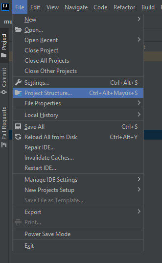
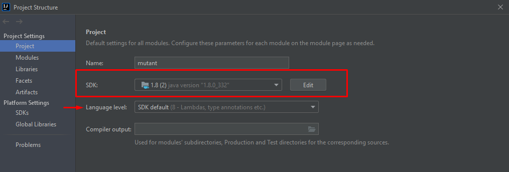
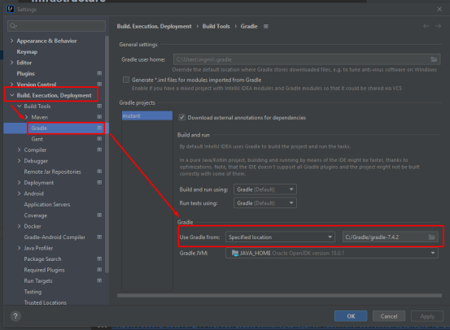
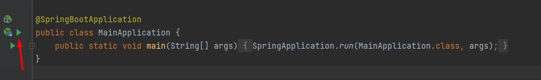
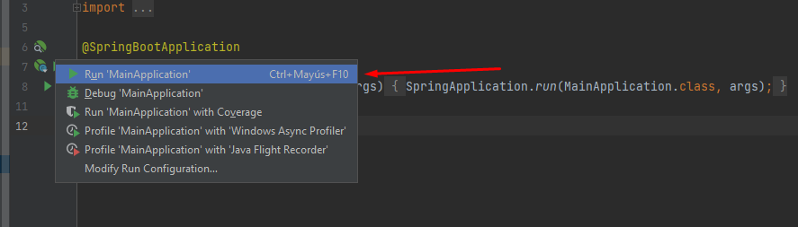
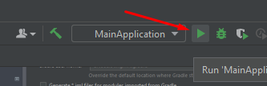
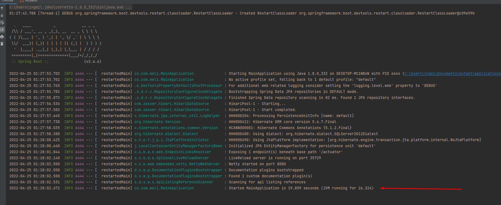
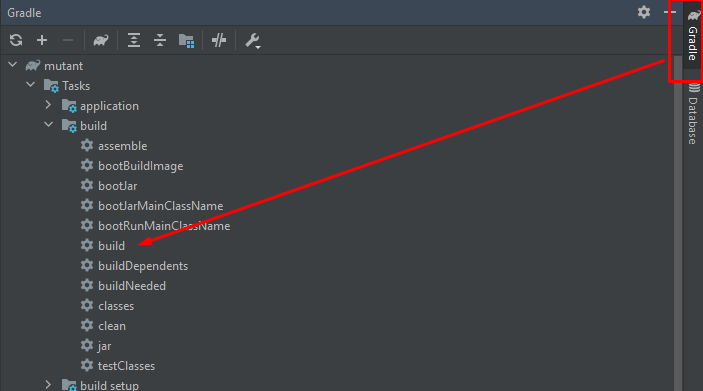
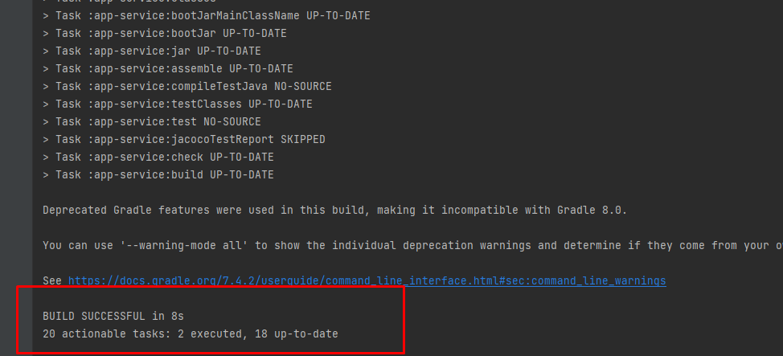
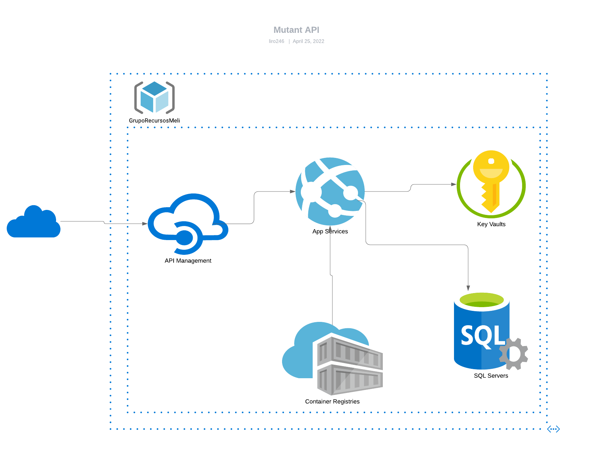

# Proyecto API Mutant

En esta API Magneto podrá detectar si un humano es mutante basándose en su secuencia de ADN.

Así como también podrá conocer las estadísticas de las verificaciones de ADN para saber que tan grande es su ejercito ahora.

- [Proyecto API Mutant](#proyecto-api-mutant)
    - [Antes de Iniciar](#antes-de-iniciar)
    - [Arquitectura](#arquitectura)
        - [Domain](#domain)
        - [Usecases](#usecases)
        - [Infrastructure](#infrastructure)
            - [Driven Adapters](#driven-adapters)
            - [Entry Points](#entry-points)
        - [Application](#application)
- [Ejecución de la aplicación](#ejecución-de-la-aplicación)
    - [Como ejecutamos la aplicación en ambiente local](#como-ejecutamos-la-aplicación-en-ambiente-local)
        - [Configuracion Editor](#configuracion-editor)
        - [Configuración variables de entorno](#configuración-variables-de-entorno)
        - [Ejecutar Aplicacion](#ejecutar-aplicacion)
    - [Como ejecutamos la aplicación en ambiente local con Docker](#como-ejecutamos-la-aplicación-en-ambiente-local-con-docker)
        - [Hacer biuld a la apicación](#hacer-biuld-a-la-apicación)
        - [Crear y ejecutar el contenedor Docker](#crear-y-ejecutar-el-contenedor-docker)
        - [Ejecutar Aplicacion](#ejecutar-aplicacion)
- [Consumo Servicios REST](#consumo-servicios-rest)
    - [Ambiente local](#ambiente-local)
    - [Nube de Azure](#nube-de-azure)
        - [Diagrama recursos Nube Azure](#diagrama-recursos-nube-azure)
        - [URL de consumo](#url-de-consumo)

## Antes de Iniciar

La aplicación base se genero a partir del plugin open source creado por Bancolombia

[Repositorio gitHub](https://github.com/bancolombia/scaffold-clean-architecture#readme)

# Arquitectura

## Domain

Es el módulo más interno de la arquitectura, pertenece a la capa del dominio y encapsula la lógica y reglas del negocio mediante modelos y entidades del dominio.
 
Aqui encontraremos:

1. gateways
   1. MutantRepository
2. Mutant.java
3. MutantOperations.java
4. Test
   1. StatisticsMutant.java
   2. MutantOperationsTest.java

## Usecases

Este módulo gradle perteneciente a la capa del dominio, implementa los casos de uso del sistema, define lógica de aplicación y reacciona a las invocaciones desde el módulo de entry points, orquestando los flujos hacia el módulo de entities.

Aqui encontraremos:

1. MutantUseCase.java
2. QueryStatisticsMutantUseCase.java
3. Test
   1. MutantUseCaseTest.java
   2. QueryStatisticsMutantUseCaseTest.java

## Infrastructure

### Driven Adapters

Los driven adapter representan implementaciones externas a nuestro sistema, como lo son conexiones a servicios rest,
soap, bases de datos, lectura de archivos planos, y en concreto cualquier origen y fuente de datos con la que debamos
interactuar.

Aqui encontraremos el modulo de persistencia jpa-repository:

1. config
   1. DBSecret.java
   2. JpaConfig.java
2. helper
   1. AdapterOperations.java
3. mutant
   1. MutantData.java
4. JPARepository.java
5. JPARepositoryAdapter.java -> Interfaz

### Entry Points

Los entry points representan los puntos de entrada de la aplicación o el inicio de los flujos de negocio.

Aqui encontraremos el modulo de web reactive-web:

1. config
    1. SwaggerConfiguration.java
2. customexception
    1. CustomExceptionHandler.java
3. dto
    1. MutantDTO.java
4. filter
   1. ApiKeyRequestFilter.java
5. healthcheck
   1. HealthService.java
6. web
   1. QueryMutantService.java
   2. QueryStatisticsMutantService.java
7. Test
   1. QueryMutantServiceTest.java
   2. QueryStatisticsMutantServiceTest.java

## Application

Este módulo es el más externo de la arquitectura, es el encargado de ensamblar los distintos módulos, resolver las dependencias y crear los beans de los casos de use (UseCases) de forma automática, inyectando en éstos instancias concretas de las dependencias declaradas. 

**Además inicia la aplicación (es el único módulo del proyecto donde encontraremos la función “public static void main(String[] args)”.**

# Ejecución de la aplicación

## Como ejecutamos la aplicación en ambiente local

### Configuracion Editor 

Para la ejecución en ambiente local se recomienda tener instalado previamente
- Java 8 o superior
- Gradle (Preferiblemente gradle-7.4.2)
- IntelliJ
- Docker

Una vez descargado el proyecto se valida en el editor de código que la configuración de la maquina virtual y de gradle. Para el caso de IntelliJ

-En el menú nos ubicamos en File -> Project Structure

-Seleccionamos la SDK y por defecto Language level queda en SDK default (8 - Lambdas, type ...)

-En el menú nos ubicamos en File -> Settings

-Como se muestra en la imagen a continuación se selecciona la ruta don de esta ubicado gradle

### Configuración variables de entorno

Se requiere agregar las siguientes variables del sistema:
  
    CLIENT_ID  : 31f2c835-f3fa-4b9d-ad05-7f39107b7206
    CLIENT_KEY : S15f60w.b7FA5sxuVpZz2ByMRKGMIWh6U9
    TENANT_ID  : cd458254-88f1-4df5-9dfd-f1e5bea9e41c

### Ejecutar Aplicacion

1. Nos ubicamos en MainApplication y en el icono que muestra la siguiente imagen damos clic derecho

Damos clic izquierso en Run "MainApplication"

2. En la parte superior se encuentra un comboBox donde seleccionamos MainApplication y damos clic en el icono que se indica

Una vez finalice la ejecución en la consola se visualizara lo siguiente:

## Como ejecutamos la aplicación en ambiente local con Docker

### Hacer biuld a la apicación

Seleccionando la pestaña lateral Gradle nos ubicamos en la carpeta mutant -> Tasks -> build y alli damos clic a build

Una vez finalice el build nos mostrara lo siguiente en consola

### Crear y ejecutar el contenedor Docker

1. Ejecutamos las siguiente instrucción:

       docker build -t apimutant .    

2. Una vez finalizado ejecutamos el contenedor creado de la siguiente manera:

       docker run -e CLIENT_ID='31f2c835-f3fa-4b9d-ad05-7f39107b7206' -e CLIENT_KEY='S15f60w.b7FA5sxuVpZz2ByMRKGMIWh6U9' -e TENANT_ID='cd458254-88f1-4df5-9dfd-f1e5bea9e41c' -p 8080:8080 apimutant

Una vez finalice la ejecución en la consola se visualizara lo siguiente:

# Consumo Servicios REST

## Ambiente local

-Requiere agregar un header de seguridad

    x-api-key : cD*&T5&k*vKh

1. URL Swagger

       localhost:8080/api/swagger-ui.html 

2. URL API
   
       localhost:8080/api/mutant/
       localhost:8080/api/stats

## Nube de Azure

### Diagrama recursos Nube Azure

### URL de consumo

1. URL Swagger

       https://mutantsmeli.azurewebsites.net/api/swagger-ui.html 

   - Requiere agregar un header de seguridad
     
         x-api-key : cD*&T5&k*vKh

2. URL API

       https://mutantmeliapi.azure-api.net/mutant/
       https://mutantmeliapi.azure-api.net/stats

    - Requiere agregar un header de seguridad

          API-Key-Mutant : f4a32a6248a942e58224e534b0b0f795